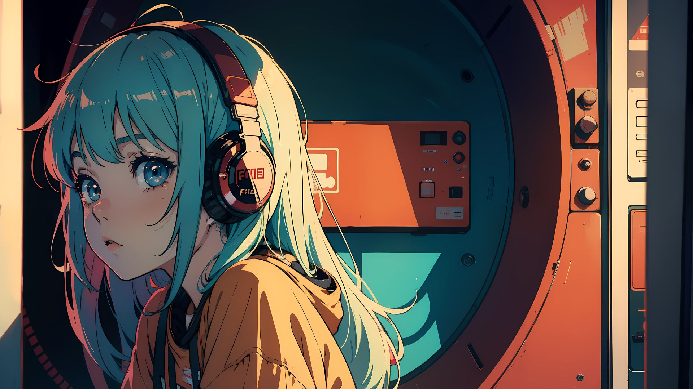
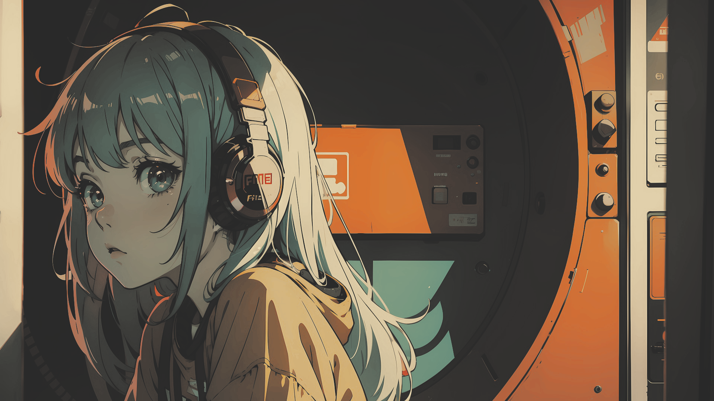

# Gruvbox Girl Revisited - [1920x1080]
  
### Lore:

I was looking for this wallpaper for a while, but I only saw rice's linux with it, but apparently it had disappeared 
I used a tool (possibly the same one that was used to modify the original image and leave it gruvbox) to try to revive the image. 

### Download:

Link: [Here](wallpaper.png)

### Used Tool

The tool used was [gowall](https://github.com/Achno/gowall), using it to convert the original image to the gruvbox scheme. 
The old image that was on the internet was practically identical to this one, the basic examples are below:

### Original:

[[Source]](https://4kwallpapers.com/anime/anime-girl-lofi-14874.html)

### Modification:

[[Source 1]](https://www.reddit.com/r/wallpaper/comments/1nankwx/gruvbox_girl_1920x1080/?utm_source=share&utm_medium=web3x&utm_name=web3xcss&utm_term=1&utm_content=share_button), [[Source 2]](https://github.com/sakaki91/gruvbox-girl-revisited/)
